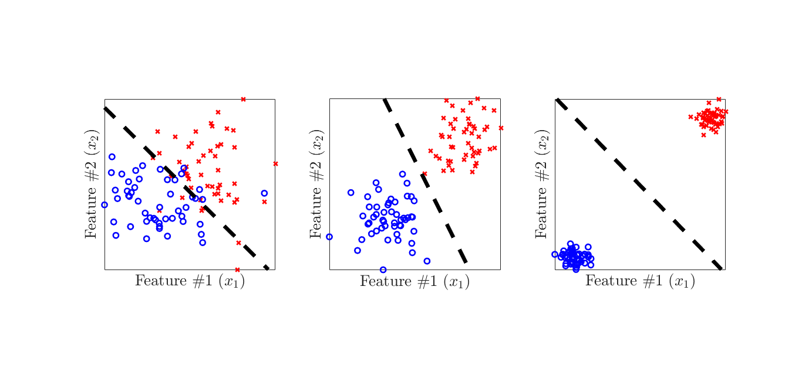

# GDMethods
Gradient Descent Methods

Description: This repository contains implementations of different verions of gradient descent algorithm.

Copyright (c) 2020 Behrad Soleimani All Rights Reserved

Contact: behrad@umd.edu

Date: April 25, 2020

Requirements: implemented in Matlab R2019a version, but should run on most versions.

Contents: 
> main.m:       **Master script**. 

> GradDescent.m:       **Gradient descent with (backtracking) line search**.

> GradDescent_BB.m:  **Gradient descent with Barzilai-Borwein update**.

> GradDescent_Nesterov.m:  **Nesterov accelerated gradient descent**.

> ProjGradDescent.m:  **Projected Gradient descent**.

> LipschitzEstimation.m:  **Lipschitz constant estimation function**.

> LogisticRegression.m:  **Logistic regression objective function**.

> DualSVM.m :  **Dual soft-SVM objective function**.

> GDMethods.pdf: **Derivation and details**.

Instructions: Simple and easy. Download all the codes in a directory and run main.m, that will generate one example described below. To use the functions individually, please look at the function descriptions. The derivations and details are also explained in .pdf file.

Example:

In this example, we consider a logistic regression problem with binary labels. In order to calssify the samples, we maximize the corss-entropy loss via gradient descent algorithms:

  

where g(*z*) = 1/(1 + *e* − *z*). Moreover, **x**(*i*) and *y*(*i*) ∈ {0, 1} represent the *i*-th data point and label, respectively. 

Fig.1 shows the convergence of three different gradient descent methods over *N=100* data points in a 3-D feature space.

|  | 
|:--:| 
| Fig 1. Comparison of the gradient descent algorithms|

As an example of projection gradient descent, we solve a support vector machine (SVM) classification. The dual problem of a soft-SVM is given by

  

where **x**(*i*) and *y*(*i*) ∈ {-1, 1} represent the *i*-th data point and label, respectively, and *ϕ(.)* is the kerenl (mapping) function. The classification is expressed as

  

In Fig.2, the soft-SVM classification is demonstrated over *N=100* data points in a 2-D feature space. It is worth mentioning that we exclude the bias term, i.e. *b=0*.

|  | 
|:--:| 
| Fig 2. Soft-SVM for three different types of data (without bias term)|
