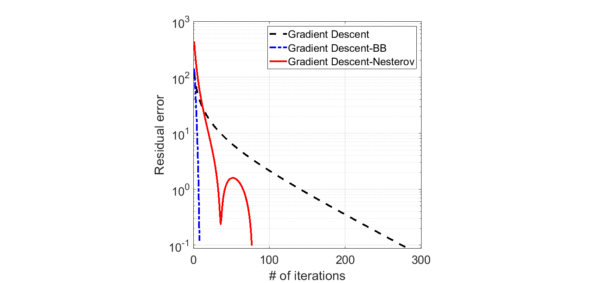

# GDMethods
Gradient Descent Methods

Description: This repository contains implementations of different verions of gradient descent algorithms.

Copyright (c) 2020 Behrad Soleimani All Rights Reserved

Contact: behrad@umd.edu

Date: April 25, 2020

Requirements: implemented in Matlab R2019a version, but should run on most versions.

Contents: 
> main.m:       **Master script**. 

> GradDescent.m:       **Gradient descent with (backtracking) line search**.

> GradDescent_BB.m:  **Gradient descent with Barzilai-Borwein update**.

> GradDescent_Nesterov.m:  **Nesterov accelerated gradient descent**.

> LipschitzEstimation.m:  **Lipschitz constant estimation function**.

> LogisticRegression.m:  **Logistic regression objective function**.

> GDMethods.pdf: **Derivation and details**.

Instructions: Simple and easy. Download all the codes in a directory and run main.m, that will generate one example described below. To use the functions individually, please look at the function descriptions. The derivations and details are also explained in .pdf file.

Example:

In this example, we consider a logistic regression problem with binary labels. In order to calssify the samples, we maximize the corss-entropy loss via gradient descent algorithms.

  

Fig.1 shows the convergence of three different gradient descent methods.

|  | 
|:--:| 
| Fig 1. Comparison of the gradient descent algorithms|

